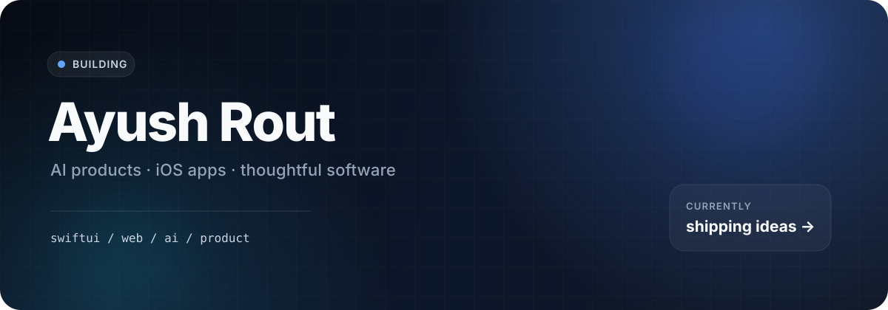

<p align="center">
  
</p>

<h1 align="center">ayush rout</h1>

<p align="center">
  <em>14 · california · building software that turns ideas into products</em>
</p>

<p align="center">
  <a href="https://ayushrout.xyz">website</a> ·
  <a href="https://github.com/530ayush12?tab=repositories">projects</a> ·
  <a href="mailto:ayushrout.ar@gmail.com">email</a>
</p>

hi — i'm ayush. i build ai-powered products, ios apps, and web experiences with a focus on usefulness, speed, and clean design.

---

### ◆ now building

## [Lotus](https://github.com/530ayush12/Lotus)

**an ai-powered website generator for turning a prompt into something you can edit, preview, save, and ship.**

currently pushing lotus toward a more complete product experience — authentication, persistent work, live previews, and smoother generation.

[repo →](https://github.com/530ayush12/Lotus)

---

### ◆ shipped

|  | project | what it is |
|---|---|---|
| `01` | **[GeniusMath AI](https://github.com/530ayush12/GeniusMath-AI-iOS)** | ai-powered ios math practice with generated questions, instant scoring, and step-by-step explanations |
| `02` | **[SereneQuests](https://github.com/530ayush12/SereneQuests-iOS)** | a swiftui wellness app with personalized quests, guided activities, progress tracking, and mindfulness tools |
| `03` | **[DitherStudio](https://github.com/530ayush12/ditherstudio)** | a browser-based studio for transforming images with dithering algorithms |
| `04` | **[BioGel](https://github.com/530ayush12/BioGel)** | a research-focused project exploring nutrient-infused biodegradable hydrogels and plant growth |
| `05` | **[ayushrout.xyz](https://github.com/530ayush12/ayushrout.xyz)** | my developer portfolio and home for projects on the web |

---

### ◆ what i build with

`Swift` · `SwiftUI` · `TypeScript` · `JavaScript` · `React` · `Next.js` · `Firebase` · `Vercel` · `GitHub` · `AI APIs`

---

### ◆ journey

```text
started   got obsessed with turning ideas into working software.
then      began building web projects and experimenting with ai-assisted development.
2025      started shipping real ios apps and learning the full product lifecycle.
2026      shipped GeniusMath AI and SereneQuests to the App Store.
2026      expanded into larger web products, experiments, and hackathon projects.
now       building Lotus, improving my craft, and shipping faster without losing taste.
```

---

### ◆ principles

**build useful things.**  
software should solve a real problem, not just exist as a demo.

**ship the full product.**  
idea → design → code → debugging → launch matters more than stopping at a prototype.

**make it feel intentional.**  
small details in interaction, wording, and visual design add up.

---

### ◆ selected work

#### GeniusMath AI
AI-powered math practice built around fresh questions, customizable learning modes, immediate feedback, and clear explanations.

#### SereneQuests
A polished SwiftUI wellness experience built around personalized quests, guided exercises, progress, and healthy routines.

#### DitherStudio
A visual web tool for experimenting with image dithering directly in the browser.

#### Lotus
My current AI-first web product — focused on making the path from prompt to working website much faster.

---

<p align="center">
  <a href="https://ayushrout.xyz">ayushrout.xyz</a> ·
  <a href="https://github.com/530ayush12">github</a> ·
  <a href="mailto:ayushrout.ar@gmail.com">email</a>
</p>

<p align="center"><em>california · building what's next</em></p>
